# NEXUS ERP Technical Architecture

## Table of Contents
1. [Architecture Overview](#section-1--architecture-overview)
2. [Frontend Architecture](#section-2--frontend-architecture)
3. [Backend Architecture](#section-3--backend-architecture)
4. [Authentication Flow](#section-4--authentication-flow)
5. [RBAC & Authorization](#section-5--rbac--authorization)
6. [Request / Response Flow](#section-6--request--response-flow)
7. [Database Architecture](#section-7--database-architecture)
8. [Inventory Architecture & Working](#section-8--inventory-architecture--working)
9. [Sales Challan Architecture](#section-9--sales-challan-architecture)
10. [Product Management Flow](#section-10--product-management-flow)
11. [Customer & CRM Flow](#section-11--customer--crm-flow)
12. [Security Architecture](#section-12--security-architecture)
13. [Deployment Architecture](#section-13--deployment-architecture)
14. [Data Integrity](#section-14--data-integrity)
15. [Important Design Decisions](#section-15--important-design-decisions)
16. [Known Limitations](#section-16--known-limitations)
17. [Future Improvements](#section-17--future-improvements)

---

## Section 1 — Architecture Overview

NEXUS ERP employs a decoupled Client-Server architecture utilizing a modern stack: React on the frontend and Express.js on the backend, communicating exclusively via REST APIs.

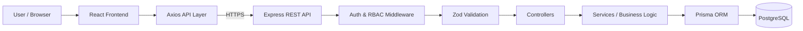

Data flows unidirectionally through specialized layers, ensuring that requests are fully authenticated, authorized, and validated before touching any business logic or the database.

---

## Section 2 — Frontend Architecture

The frontend is built as a robust Single Page Application (SPA).

- **Core**: React 18, TypeScript, Vite
- **Routing**: React Router v6
- **State & Data Fetching**: TanStack Query v5 (React Query) handles API caching, invalidation, and async state.
- **Forms & Validation**: React Hook Form paired with Zod.
- **Styling**: Tailwind CSS v4.

**Request Flow**:
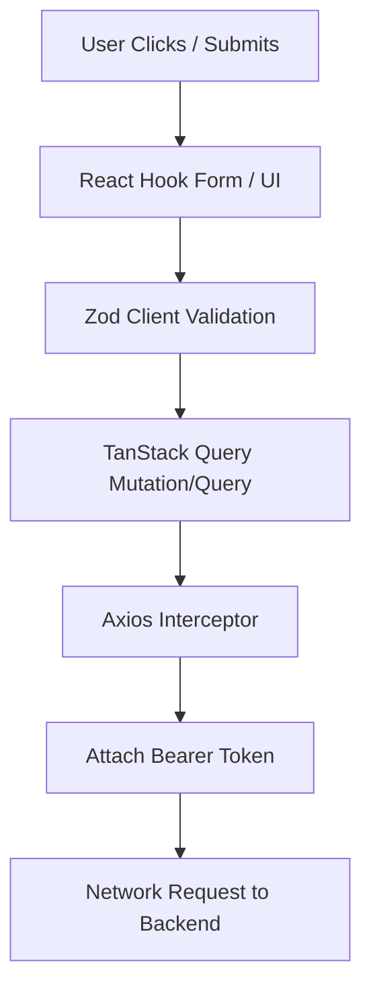
The application dynamically adjusts the UI based on the user's role (extracted from the JWT or `/auth/me`). `Axios` interceptors automatically inject the JWT token (stored in localStorage) into the `Authorization: Bearer <token>` header of every outbound API request.

---

## Section 3 — Backend Architecture

The backend is built using Node.js and Express.js, utilizing a modular, domain-driven structure (`/src/modules/`).

- **Core**: Node.js, Express, TypeScript
- **Validation**: Zod
- **Database**: Prisma ORM, PostgreSQL

**Module Structure**:
Each domain (Auth, Customers, Products, Inventory, Challans) encapsulates its own:
- `*.routes.ts` (Express router)
- `*.controller.ts` (HTTP request/response handling)
- `*.service.ts` (Business logic, Prisma interactions)
- `*.schema.ts` (Zod schemas for payload validation)

**Request Lifecycle Diagram**:
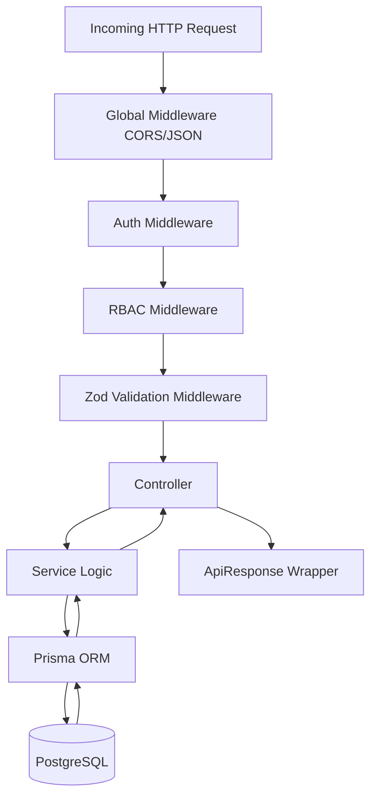

---

## Section 4 — Authentication Flow

Authentication is statelessly implemented using JSON Web Tokens (JWT).

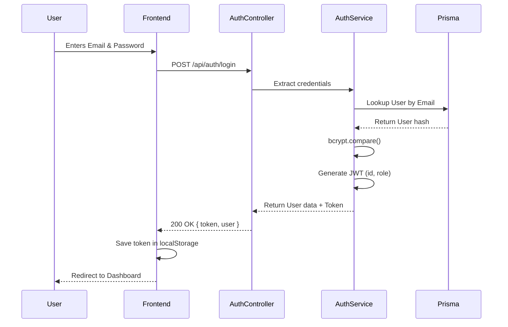

No session state is maintained on the server. The JWT expiration acts as the session boundary.

---

## Section 5 — RBAC / Authorization

NEXUS ERP defines four hierarchical/functional roles in `schema.prisma`:
- `ADMIN`: Full system access.
- `SALES`: CRM and Sales Challan creation/management.
- `WAREHOUSE`: Product catalog and Inventory/Stock management.
- `ACCOUNTS`: Read-only overview access.

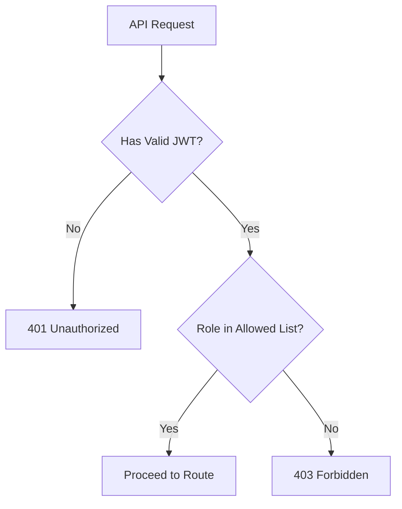
While the frontend conditionally renders links (e.g., hiding "Inventory" from Sales), the **server-side RBAC middleware** is the absolute security boundary. If a user tries to forge a request to an unauthorized route, the server blocks it with a `403 Forbidden`.

---

## Section 6 — Request / Response Flow

Below represents a standard authenticated request (e.g., `POST /api/products`):

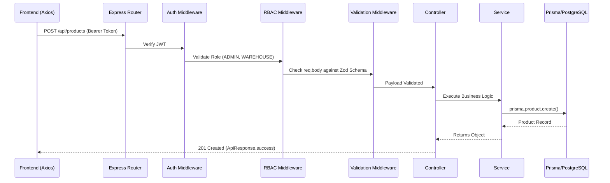
Any error thrown inside the Service or Controller is caught by a `try-catch` and forwarded to a global error handler using `next(error)`, returning a unified `{ success: false, error: ... }` JSON structure.

---

## Section 7 — Database Architecture

The core data models are strictly defined in `server/prisma/schema.prisma`.

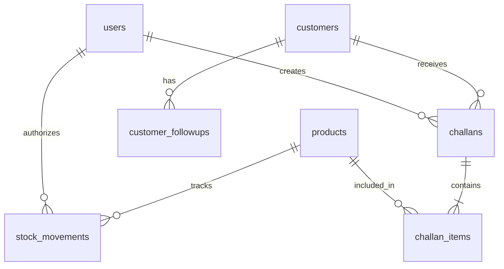

- **User**: Operators of the system.
- **Customer**: CRM profiles with status (LEAD, ACTIVE, INACTIVE).
- **CustomerFollowUp**: Historical interaction logs.
- **Product**: Catalog items. Tracks `currentStock` and `minStockAlert`.
- **StockMovement**: Immutable ledger of inventory (`IN` or `OUT`).
- **Challan**: Document representing a sale/dispatch (`DRAFT`, `CONFIRMED`, `CANCELLED`).
- **ChallanItem**: Crucially includes **snapshot fields** (`productName`, `sku`, `unitPrice`). If a product's base price is changed later, the historical challan remains accurate.

---

## Section 8 — Inventory Architecture & Working

Inventory is managed through two parallel systems: a real-time current stock integer (`currentStock`), and an immutable ledger (`StockMovement`).

**Core Behaviors**:
1. Stock can be adjusted manually (`/api/inventory/adjust` via WAREHOUSE/ADMIN) or automatically via Challans (via SALES/ADMIN).
2. Every change generates a `StockMovement` row with type `IN` or `OUT`.
3. Negative stock is strictly prevented on the backend.
4. "Low Stock" is logically calculated as `0 < currentStock < minStockAlert`. "Out of Stock" is `currentStock === 0`.

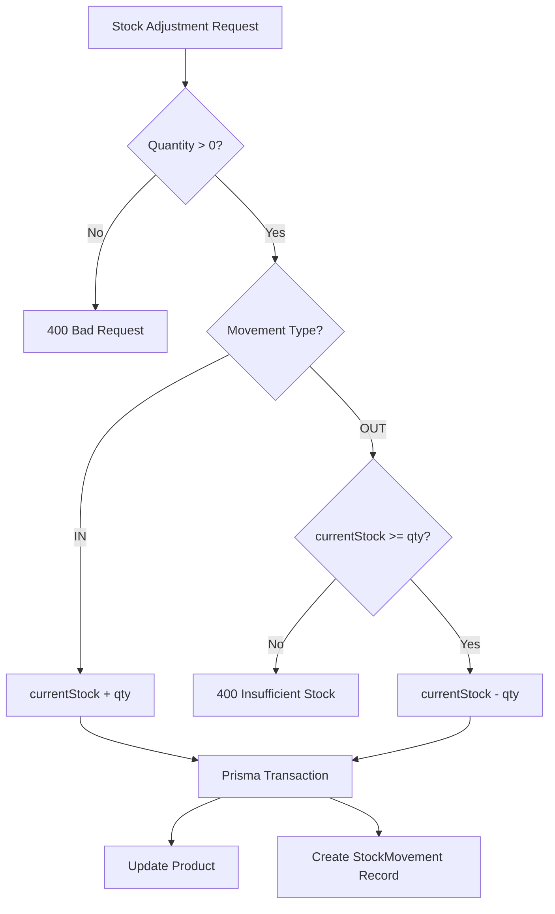

---

## Section 9 — Sales Challan Architecture

The Sales Challan is the most complex business flow, heavily intertwined with inventory.

1. **Draft**: A challan is created as a `DRAFT`. No stock is affected.
2. **Confirm**: The user confirms the challan.
3. **Execution**: The backend utilizes a Prisma `$transaction` to ensure atomicity.

**Sales Challan Flow**:
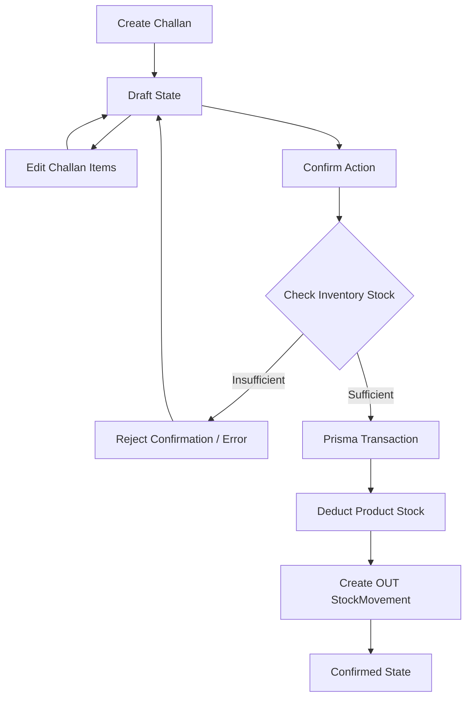

**Sales Challan Confirmation Sequence**:

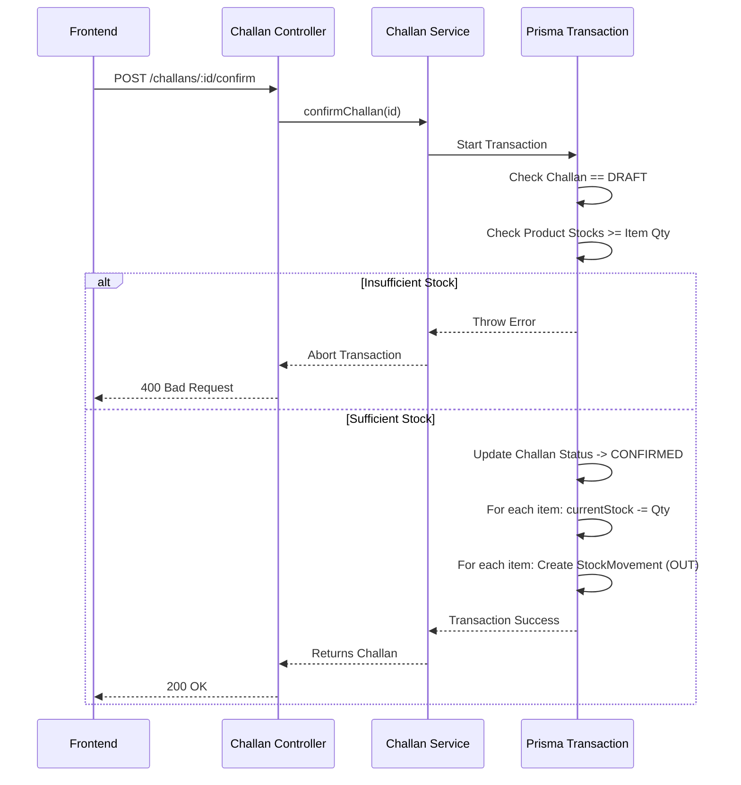

---

## Section 10 — Product Management Flow

Products are managed by WAREHOUSE and ADMIN roles.
- The `ProductController` handles creation, updates, and fetching.
- Fields include `sku`, `name`, `unitPrice`, `minStockAlert`, and `location`.
- The frontend `ProductsPage` enables global search and dynamic client-side filtering for Low Stock based on strict logic (`0 < currentStock < minStockAlert`).

**Product Management Flow**:
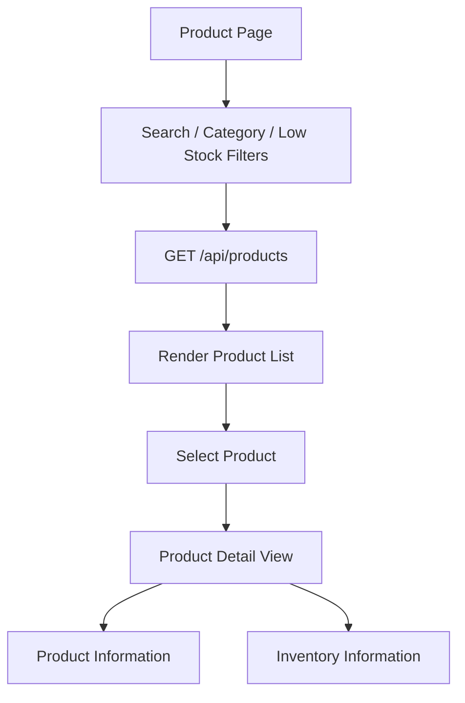

---

## Section 11 — Customer / CRM Flow

Customers are managed by SALES and ADMIN roles.
- `CustomerController` manages creation and status updates.
- Deep linkage via `customer_followups` allowing Sales representatives to leave notes on accounts for future review.
- Accounts are paginated on the backend to handle large CRM databases efficiently.

**Customer / CRM Flow**:
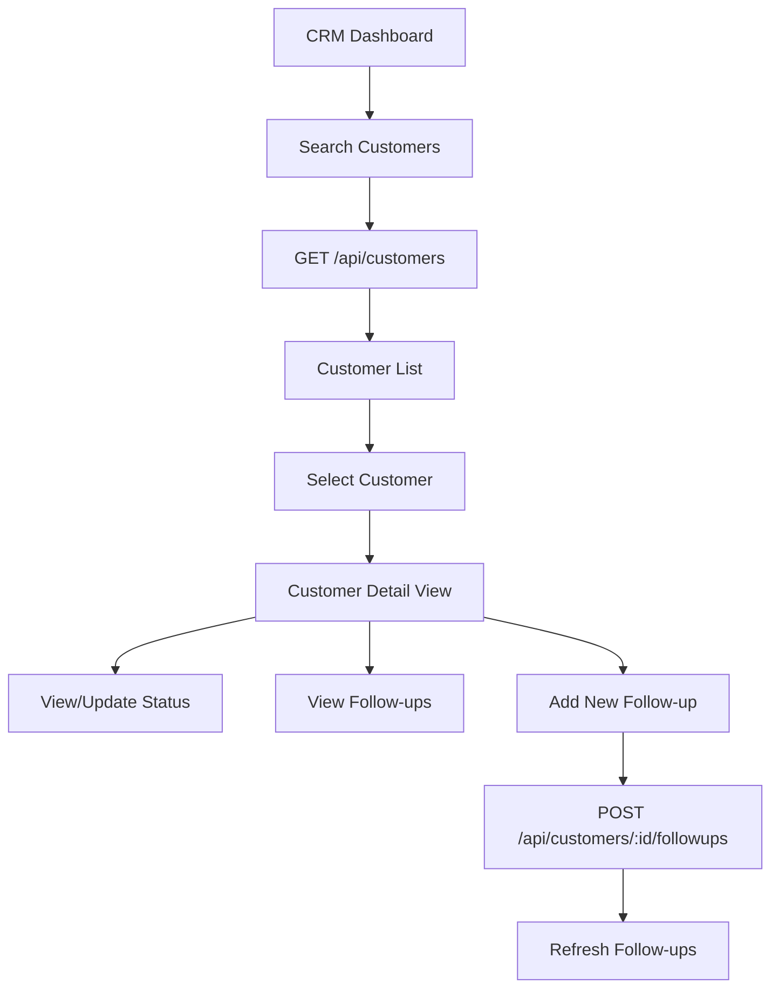

---

## Section 12 — Security Architecture

- **Stateless Tokens**: JWTs prevent session hijacking and cross-site request forgery when used with authorization headers instead of cookies.
- **Passwords**: Hashed with robust salt rounds using `bcryptjs`.
- **Validation**: `zod` acts as a firewall, ensuring no malicious or malformed payloads ever reach the database queries.
- **CORS**: Explicitly restricted in `.env` (`CORS_ORIGIN`).
- **Separation of Concerns**: Frontend UI hiding (UX) vs Server-side RBAC enforcement (Security).

---

## Section 13 — Deployment Architecture

The actual production deployment leverages decoupled platforms:

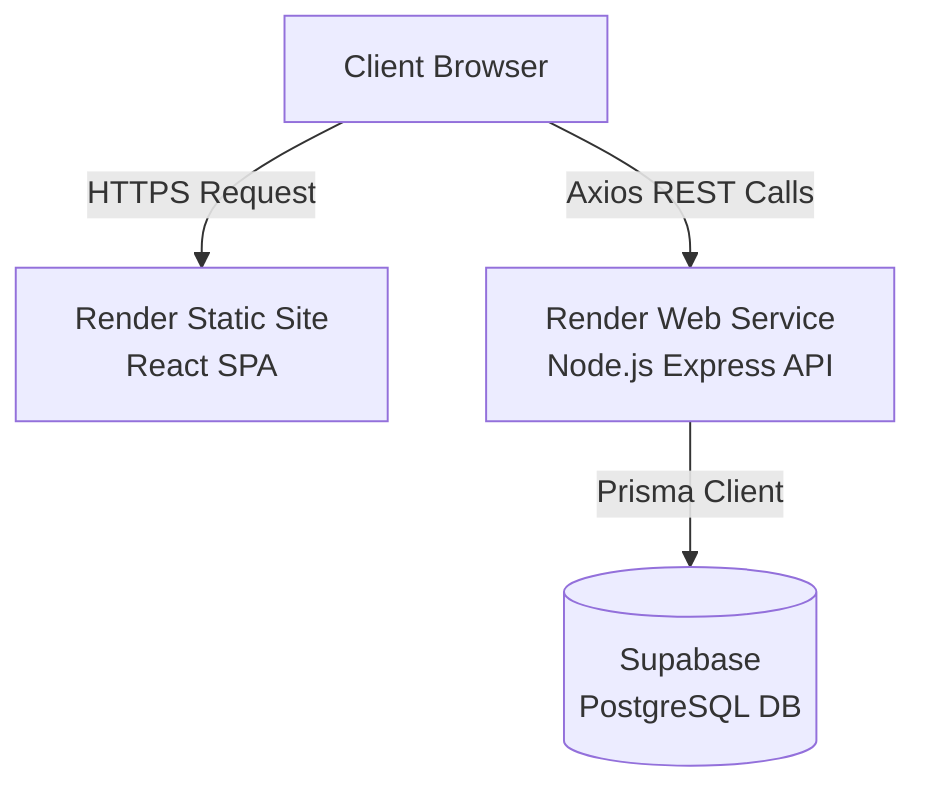

**Production URLs**:
- Frontend: `https://nexus-erp-1szs.onrender.com`
- Backend API: `https://nexus-erp-api-rars.onrender.com`
- Backend Health Check: `https://nexus-erp-api-rars.onrender.com/api/health`

---

## Section 14 — Data Integrity

Data integrity is protected by strict mechanisms enforced by the backend and database:
- **Snapshot Fields**: Challan Items copy product text and price data. If a product is deleted or renamed, past financial challans remain perfectly intact.
- **Transactions**: Prisma `$transaction` guarantees that a challan is never marked as confirmed if the corresponding stock deduction fails.
- **Ledger System**: Inventory amounts are backed by immutable `StockMovement` logs.
- **Unique Constraints**: DB-level uniqueness on `users.email`, `customers.email`, `products.sku`, and `challans.challanNumber`.

---

## Section 15 — Important Design Decisions

- **React + TypeScript**: Provides end-to-end type safety and highly predictable rendering for complex data grids.
- **Prisma ORM**: Chosen for its robust schema definition capabilities, type-safe generated client, and built-in transaction support crucial for financial/inventory systems.
- **Feature-Oriented Structure**: Backend directories group Routes, Controllers, and Services by module (e.g., `customers/`), vastly improving maintainability over flat architectures.
- **Soft Document States**: Challans utilize `DRAFT` and `CONFIRMED` states rather than immediately executing inventory modifications, allowing for sales negotiation and editing before finalization.

---

## Section 16 — Known Limitations

- **Single Warehouse**: The system schema assumes a single physical location for inventory. Multi-warehouse tracking is not fully supported.
- **Printing**: Document printing relies on browser-native `window.print()` functionality rather than backend PDF buffer generation.
- **Email Notifications**: Password resets and customer follow-up alerts currently lack an integrated SMTP email service.

---

## Section 17 — Future Improvements

- **Server-Side PDF Generation**: Generate immutable PDFs for Challans upon confirmation and store them in object storage (AWS S3).
- **Multi-Warehouse Support**: Expand `StockMovement` and `Product` models to include `warehouseId`.
- **Automated Alerts**: Email triggers for low-stock items sent to warehouse managers.
- **Advanced BI Dashboards**: Integration of charting libraries for Sales velocity and CRM conversion reporting.
